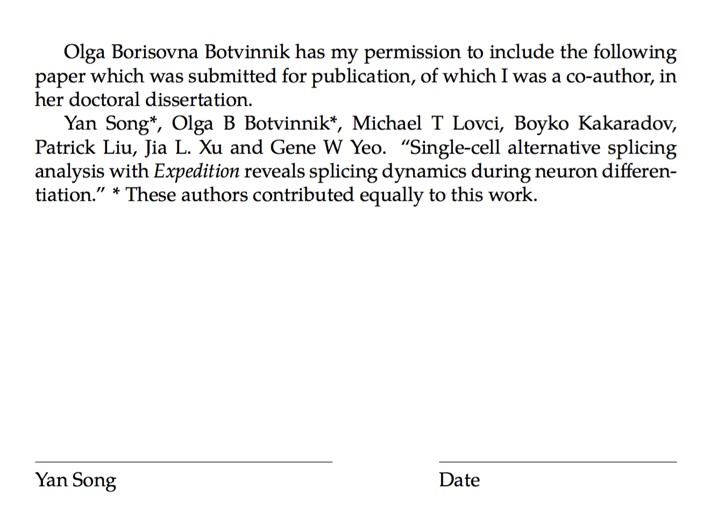

# Dissertation publication permission letters

This will generate the permission letters from your co-authors on publication or pre-publication manuscripts that are required for UCSD dissertation submission.

See the `Makefile` for the list of names and `template.tex` which shows three different example texts for:

1. Published manuscripts
2. Submitted, but not yet published manuscripts
3. Manuscripts in preparation

Here is the example output with the name `'Yan Song'` (notice the full name under the signature line):



## Usage

To create permission letters, do:

```
make all
```

To remove all the LaTex intermediate output, do:

```
make clean
```
